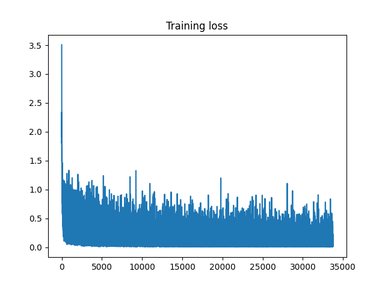
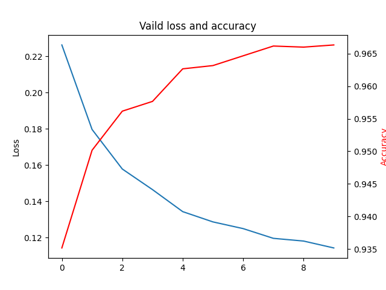
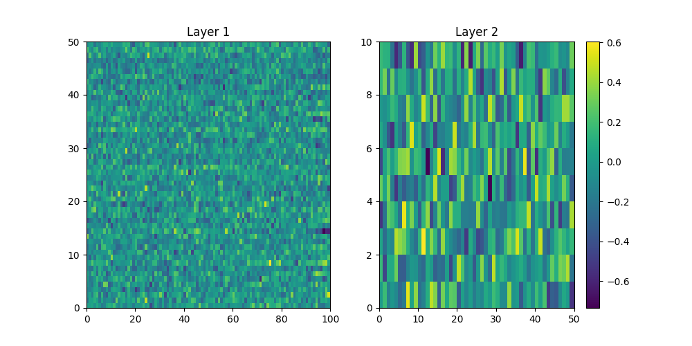

# PJ1: 构建两层神经网络分类器

Shiyuchen, 21210980116

### 基本信息

- repo: https://github.com/Lightblues/NN-pj
- model checkpoint: 
- 数据集: [MNIST](http://yann.lecun.com/exdb/mnist/) 手写数字识别
  - 包括 60,000 和 10,000 条训练和测试样本;
  - 随机划分训练集中的 10% 作为验证集;
- 激活函数: ReLU
- 正则化: 对于全连接层的W矩阵进行L2正则化
- 优化器: 采用SGD, 并尝试了`StepLR` 学习率下降

### 参数查找

设置 `mini_batch_size=16, epochs=10`, 对于 学习率，隐藏层大小，正则化强度 这三个超参数进行搜索. 实验设置和结果如下表所示:

| Test acc              |       |       |       |       |       |
| --------------------- | ----- | ----- | ----- | ----- | ----- |
| wd (lr=1e-4, d=30)    | 0     | 0.001 | 0.01  | 0.1   | 1     |
|                       | 88.16 | 88.31 | 87.79 | 87.56 | 64.03 |
| lr (wd=0.001, d=30)   | 1e-5  | 1e-4  | 1e-3  | 1e-2  | 1e-1  |
|                       | 62.05 | 88.06 | 89.93 | 90.03 | 85.83 |
| d (wd=0.001, lr=0.01) | 10    | 30    | 50    | 100   | 300   |
|                       | 89.52 | 89.83 | 90.40 | 90.20 | 89.93 |

根据实验结果, 在最终模型中, 设置 `learning_rate=0.01, d_hidden=50, weight_decay=0.001`.

### 学习率下降策略

在上述超参数设置下, 尝试学习率下降策略. 以下仅尝试了 `StepLR`, 也即, 训练经过 `step` 轮次后, 将学习率下调为原来的 $\gamma$ 倍, 下表总结了在不同的参数设置下, 经过学习率下降策略的测试准确率:

|                   | Test acc |
| ----------------- | -------- |
| None              | 97.07    |
| StepLR(300, 0.99) | 96.77    |
| StepLR(500, 0.99) | 96.82    |

设置 `mini_batch_size=16, epochs=10`, 从上述实验结果可以看到, 经过学习率下调之后测试准确率反而有下降. 原因主要有二: 1. 因为训练轮次和学习率设置得比较小, 模型还未过拟合; 2. 经过 $L_2$ 正则化之后, 模型有较好的泛化能力.

### 实验过程可视化

训练过程中每个batch (大小为16) 的 loss 变化可视化如下:

在训练过程中, 验证集损失和准确率变化情况如下:

### 网络权重可视化

提取网络全连接层权重, 以热力图的形式进行可视化. 下图展示了网络结构为 `[784, 50, 10]` 时, 两个全连接层的参数. 注意在第一层中输入维度为 784, 为了可视化需要仅展示了前 100个特征.

从右图可知, 对于不同的数字类别 (Y轴), 在最后的分类层中, 神经网络对于隐层的不同特征施加了不同权重. 因此, 可以认为模型在学习的过程中, 中间的隐层起到了特征提取的作用, 最后的分类层利用了这些特征进行分类.
